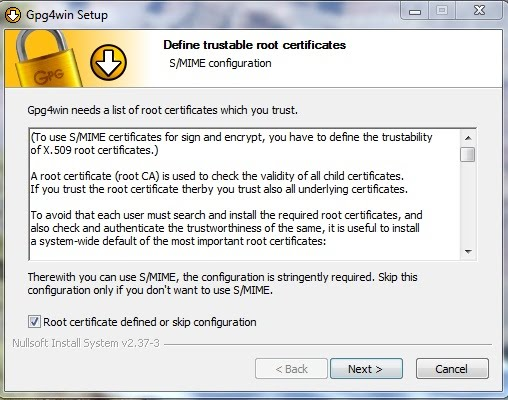

Live Torized Operating Systems
===============================

Why Secure with a Live Torized Operating System
-----------------------------------------------

The concept of using a virtual or "live" operating system may appeal to you now simply because it makes it almost impossible to get a virus or have all your private data corrupted, altered or destroyed by some outside force. But you may not know what is encryption and why is it necessary to use encryption like military personnel which TOR employs. 

Encryption is a mathematical formula that is used to jumble your words so that no one but the person who knows the formula can read. That person can share the formula with others if they wish to and do this by giving them a copy of the secret formula. 

If you haven't noticed yet - the internet has killed television, radio, public libraries, and has morphed everything into a huge hive mind. Awesome. But the people who have made their living off the backs of artists and intellectuals - movie companies / recording companies / publishing companies - are all upset because it is much harder to be a middleman. As well as this, the advertising and marketing industry in many ways financed these companies and not being able to force you to watch a commercial is a problem.

Along comes internet advertising and while we are at it would it not be nice if we could watch what you do on the internet so that we can send you only the ads that would produce results. This is done by Google who is the worse search engine to use because this information is not only sent to multinationals but also to the government for national security purposes.

You might say that you do not do anything illegal so why do you care if someone is watching you. Alright - two things - one is if your government employee next door gets to watch your searches is it not fair that you should be able to watch your next door government employee's searches then. Why the inequality? And two - what if the government employee next door or the multinational corporate employee next door wants to abuse that information?

There are many ways to abuse information. But the most insidious abuse is to withhold information from you as to exercise control over you.  If I knew how to live forever or a free energy source or that you owned a plot of land. And kept this information secret. You would continue paying medical bills, the cost of gasoline and scrambling to pay your mortgage to a bank. You would never know the truth and I would make myself rich off your hard work. Mu ha ha!

Encrypted information cannot be censored, surveilled, controlled or abused.

Or maybe there is a more sinister force on the net that is looking for people who are saying bad things about a political party and then those people are exterminated. It happened in Egypt. Protesters were hunted down by the government using the internet and they were killed. Think about the most self righteous obnoxious idiotic hateful government employee that you had to deal with and know that that person has access to your email and all your other personal information and can do whatever they want with it. 

Maybe you are not convinced yet why to use encryption so consider this. All military, government employees and corporate personnel are REQUIRED to use encryption. Only the public at large are in the clear. If you remain in the clear without encryption you are just plain stupid. Even the stock market is being manipulated by gathering public communications off the internet by people who do not use encryption. 

In fact - it is in the best interest of the state that you do not use encryption. If people all used encryption then citizens would be terribly hard to control. And for the last 10 years there has been numerous strategies put in place for just that. To be able to watch you but not let you watch the watcher. For example the whole IPv6 move is just all about being able to route all traffic through a specific gateway so that it is easier to filter and analyze. The whole push to regulate and control the internet is due to the aggressive motivations of control over you. It is not at all about security.

The TOR network is the going standard for generic encrypted internet communications aside from adding a secure channel directly to a server or a VPN as military. Remember military use a VPN in addition to a similarly encrypted network as the TOR network  the Siprnet. And that the Siprnet was modeled by the TOR project. What is good for the military must be good for you. Incidentally the members of the PPP private public partnerships with government are given a free pass to the Siprnet. But if you are not a government employee or a private military contractor or a member of a private corporate encrypted network then you need to get yourself to the TOR network fast.

How to Install TAILS USB Live Torized Operating System
------------------------------------------------------

The following is a tutorial for you to create your own USB TAILS stick.  All what is involved is you have to download the TAILS iso file, verify the iso, download an installer program, insert a formated USB in your computer and execute the installer then your live TAILS USB operating system is ready to boot from. This may be confusing for some people so we will walk through this process one step at a time. This tutorial was tested on a Windows XP and Vista box but should be fine for Windows 7 and 8 also.

FIRST STEP
First we prepare a USB drive. You need a USB stick with at least 2 Gigabyte's of space. You will need two empty USB sticks if you want one for your private GPG key that we will generate. All existing data will be lost when you install the live system so make sure you have saved any valuable data elsewhere on the USB you are going to use for Tails. If the USB drive is not new it is a good idea to format it to FAT32 to make sure it is free from any malware. With the USB drive connected to your computer open the Computer icon by double-clicking, highlight the drive that is the USB (make sure to select the correct drive), right click and on the pop up Menu select Format. When the box appears and for the "File system" field choose to format to FAT32. Then under "Format options" check the box for "Quick Format". In the "Volume label" box type TAILS so that we will know it is the Tails live distro on the USB. The rest of the fields can be left to their defaults. Now click the "Start" button. You will get a warning - so make sure you are formatting the correct drive then click "OK". The format will begin and in a few minutes your USB will be ready to work with.

TIP: If you don't like the idea of using a USB you can also install the TAILS live system on a spare partition that is at least 2G in size!

SECOND STEP
Now you need to download the TAILS iso file. At the time this tutorial was written, the current TAILS iso was version Tails 0.16. This will change over time as new versions are created so note that this version reference throughout the tutorial may be different and change your version links accordingly. We also need the key and the signature which is used to verify the authenticity of the downloaded iso image file. Open your browser and go to https://tails.boum.org and click on the big green download button. Remember where you have saved the iso file because you will need to know this. You need to also download the "cryptographic signature" as well as the "Tails signing key". So click on the big green button for each of these to download as well and put them in the same place as the Tails iso image file. The signature file is the one with the .pgp or .sig ending and the key is the file that ends in .key or .asc. The signature file is used to verify the integrity of the TAILS iso file and will tell us if the file we downloaded is absolutely identical to the iso file that the TAILS project created by doing a mathematical calculation. The Tails key file is used to prove that the TAILS project was ultimately with out a doubt the one who created that iso and iso signature by doing a second calculation.

TIP: You can do three things with a "key" - encrypt data, decrypt data and make a signature on data.

THIRD STEP
Now we need to download GPG4Win. We need this to verify that the iso file is authentic and that it has not been tampered with. To do this we need to install a program that will verify the integrity for us called GPG4Win because Windows does not have any such program built-in (if you have already installed GPG4Win then skip this section). Open your browser and go to http://www.gpg4win.org/ and click the big green button to download it. Remember the location where you downloaded GPG4Win. Observe the Sha1 checksum hash code related to the version you just downloaded. The Sha1 checksum hash code for the 2.1.0 version is f619313cb42241d6837d20d24a814b81a1fe7f6d. Unfortunately since Windows operating systems does not have a hash calculator program built-in that we can use to verify the Sha1 checksum hash code with either we need to download and install another small program called Hash Check to do this. So open your browser and go to http://code.kliu.org/hashcheck/ and click on the "Download Installer" button in the blue box. When you have finished downloading, run the installer. Now navigate to where you saved the gpg4win-2.1.0.exe file right click it and choose "Properties". In the box that popped up select "Checksums" and you will now see Hash Check calculate them. Now we cut and paste the Sha1 hash code listed on the GPG4Win download page into the box and click the "Find" button. If there is any hash matching in the calculations it will be highlighted. Now we know the file is good.

TIP: A Sha1 checksum hash code is another less secure method to verify the integrity of a file that utilizes just one mathematical operation opposed to checking a GPG signature / key which composes two operations.

FORTH STEP
Now we can run the GPG4Win installer. If you have already installed GPG4Win skip this step. The package includes GnuPG, Kleopatra, GPA, GpgOL, GpgEX, Claws-Mail and Gpg4win Compendium. Make sure they are all checked. When asked if you would like to make the Claws-Mail program your default email program - it is a great way to encrypt your emails if you use an email client to access email. When you are asked to "Define trustable root certificates" for "S/MIME Configuration" check the box "Root certificate defined or skip configuration" and click "Next" then "Finish". If you choose to use Claws-Mail email client instead of the un-safe default Windows email client you can configure a certificate latter. A good one is the Cacert at http://www.cacert.org/index.php?id=3. A certificate can be thought of as a type of key that comes from a server computer - not form a person. Now restart your computer.

TIP: Did you ever wonder why Windows has no inherent applications to encrypt, decrypt, sign, hash or verify? The reason is that Windows was intentionally built without concern for user safety, security and privacy!

FIFTH STEP
Now we create our own private key. If you have already done this you can skip this step. Open the newly installed GPA program – which is also called the Key Manager. It will inform us "Your do not have a private key yet. Do you want to generate one now (recommended) or do it later?" Click on the "Generate key now" button. Answer the questions and be sure to create a backup copy to a safe place - if you have another USB for use for your private key then save a copy there. To save a copy of your PGP PUBLIC KEY BLOCK – that you can share with friends so that they can send you encrypted messages - highlight your newly created crypto key and click on the "Export" button, give it a file name like MY_PGP_PRIVATE_KEY.txt then select the location where you saved a copy of your PGP PRIVATE KEY and soon you will see a pop up saying the key has been exported. DO NOT SHARE YOUR PGP PRIVATE KEY. You can share your PGP PUBLIC KEY with friends by copying and pasting it to the end of your emails so they can encrypt emails to you! Cool huh? Then they can share their public key with you so that you can use it to encrypt messages to them. The key can also be shared with others either in person on a business card, through a dedicated URL that posts crypto keys or by posting it onto your web-page or blog. Note: your personal key should be signed automatically by default, check this by looking at your key and see if the Validity field says Fully Valid. If not then highlight your key and click "Sign" and check "Sign only locally" then "Yes". When the box opens for you to "pinentry" enter your "Passphrase" again. Now you will see that the Validity field is Fully Valid. Your key is now signed. A signed key simply means that you trust it comes from the person who claims it does - which is you.

TIP: Military personnel save their key to a handy external USB called a CAC card which they carry with them at all times.

SIXTH STEP
Now we need to import the key file from TAILS. After we import the key we can then verify the integrity of our TAILS iso because the key is used to prove who created the signature of the iso in a two step cryptographic calculation. The signature key is obtained either in person, by asking someone else to share it from their keyring through a dedicated URL or by copying-and-pasting it from a web-page as we have done. Some host Key Signing Parties. 

Due to a Windows issue you may need to rename the tails-signing.key to tails-signing-key.asc you can try the following without renaming it but I found that it was necessary even though a key file can be shared in either extension. Open the GPA program and click on the "Import" button. In the box that popped up navigate to the key file which in case of the tails key ends in .key as seen in the tails-signing.key that you downloaded with the TAILS iso. Click "OK" and you should see another box popping up saying that "1 public keys imported" and click "Close". If you have problems importing the key with that extension then open the "Computer" icon and navigate to the key location, highlight it and right click, select "Rename" then name it "tails-signing-key.asc". Then try to import again. We are done importing the key. 

Now we need to verify visually that the key is coming from the Tails developers so we can decide if we want to sign the key or not. If we don't fully trust the key and do not sign it that is OK. We will just get a yellow box saying the signature for the iso file is alright but that there is not enough information to check signature validity when we go to verify the signature in the next step. So open your web browser and go to https://duckduckgo.com/ and do a search for the key ID BE2CD9C1 or the Fingerprint: 25FC 1614 B8F8 7B52 FF2F 99B9 62AF 4031 C82E 0039 and see if other people think that it comes from the Tails developers. If you feel secure that it probably is authentic then go ahead and sign the key - if not don't sign the key. 

To sign the key open GPA and highlight the tails key, click "Sign" and check "Sign only locally" click "Yes". When the box opens for you to "pinentry" enter your "Passphrase" that you created for your personal key. Now you will see that the Validity field for Tails has changed from Unknown to Fully Valid. You have now signed the key.

TIP: Having a CryptoParty or a  Key Signing Party is a great excuse to get together with friends.

SEVENTH STEP
Now we are ready to verify the TAILS iso signature.To verify the TAILS iso we will open Kleopatra. You will notice that the Tails certificate (signature) keyfile is listed under Trusted Certificates not Other Certificates if we have signed the key in the previous step. Now click on the "File" menu link and then click on the "Decrypt/Verify Files" link. Another box will pop up and ask us to "Select One or More Files to Decrypt and/or Verify" and we must navigate to the location where the TAILS .iso file, signature file and the key files are located. We want the signature file so select the file ending in .pgp or .sig something like tails-i386-0.16.iso.pgp and click "Open". Another box will then open asking us to "Choose operations to be performed" and we now check the box beside "Input file is a detached signature" and in the "Signed data:" box we click on the icon to the right and select the location of the TAILS .iso file in the pop up box then click "Open" again. Finally we click on the "Decrypt/Verify" button. The program should take some time to verify the signature. It should then display  "Results" under which a green box appears. Click on "Show Details" and it says the signature was signed on a specific date by tails@boum.org with a Key ID matching the Tails signing key in GPA, something like "Signed on 2013-11-26 13:45 by tails@boum.org (Key ID: 0xBE2CD9C1) and that "The signature is valid and the certificate's validity is fully trusted." If you get a yellow box says the signature was signed on a specific date by tails@boum.org with a Key ID matching the Tails signing key but that there is "Not enough information to check signature validity" this means that the signature is OK but you either have not imported the key or that you did not sign the key. You do not sign a key unless you are 100% certain that the key is from who claims it is from. This is usually done in person at a key signing party or some other function. But since we can see all over the internet that the Tails key is the same everywhere it must be authentic so I signed mine.  

Setting the trust level of a key is usually done through establishing a web of trust. Ultimately trusting a key that you've received over the Internet is considered unsafe. Generally, you should only trust keys that you have received in person. But since we are only using this key to establish who created the signature of the iso, all we need to know is if the iso was signed by Tails developers. Which it was.

TIP: All government and corporate employees are required to us encryption and so should you!

EIGHTH STEP
Now we are going to create a boot-able USB with the TAILS iso file that is verified. To do this we want to download and install a program that will do this for us to make it easy, otherwise we can mess with the command-line and the Grub bootloader. But for the average Windows user it is too complex. So go to http://www.pendrivelinux.com/universal-usb-installer-easy-as-1-2-3/ and click on the big blue Download UUI button to download the "Universal USB Installer". The hash code is underneath the big blue “DOWNLOAD UUI Universal-USB-Installer/Universal-USB-Installer-1.9.3.1.exe” button in the form of an MD5 hash code. It is listed as “MD5: 5BF1663DAA98231C1CE076B22653AD0A” as of the date this tutorial was written. Understand, though, that if there is an update to the program a new MD5 hash code would be generated so it may change. After the download is complete right click the “Universal-USB-Installer-1.9.3.1.exe” file and select “Properties” then in the box that pops up select "Checksums" and you will now see Hash Check calculate them. Now we cut and paste the MD5 hash code into the box and click the "Find" button. If there is any hash matching in the calculations it will be highlighted. Now we know the file is good.

Now insert your USB drive and fire up UUI and you will be see a security warning click "Run" then you will see a license agreement click "I Agree" and then you will be presented with the "Setup your Selections Page" dialogue. In "Step 1: Select a Linux Distribution from the drop-down to put on your USB" choose "T(A)ILS".  In "Step 2: Select your tails* .iso" click the "Browse" button to the right and navigate to the location of your recently downloaded Tails distro something like "tails-i386-0.16.iso". In "Step 3: Select your USB Flash Drive Letter Only". At this point stop and make SURE the drive letter for the USB is correct by opening up the "Computer" icon and check which drive letter it is. If you do not do this and you choose to install to your Windows C: drive by accident say goodbye to Windows and all your data because IT WILL BE OVERWRITTEN BY THE INSTALLER! So make double sure to select the correct drive letter in the drop down box. Now click "Create". 

After the UUI installer completes, you are just about ready to start Tails from the USB stick.

TIP: After you install the first Tails USB you can use the included Tails USB installer in TAILS to make more boot-able TAILS USB's for your friends!

NINTH STEP
Now we need to boot the USB using the BIOS boot menu. Then we simply choose to boot from the USB drive by selecting it from the boot menu at start-up of your computer. To do this involves accessing the BIOS (basic input output system). This is done by pressing a key as your computer is booting up. This key is usually F1 or F2, but it can be a different key or sequence of keys depending on your make and model of your pc. Check this in the chart at http://www.pendrivelinux.com/how-to-access-bios/. After you have figured out which key(s) to use and you have accessed the BIOS you need to enable the boot menu to allow to boot from the USB. This is under the "Boot" heading in the BIOS. Look for something about a boot sequence or boot device and enable the USB to be allowed to boot. Please do not change any other settings as you could cause unintended problems with how your computer functions. Save the settings and exit. Now plug in the USB and turn on your pc. As  your pc boots you need to press the key that displays the boot menu which is usually the ESC key but can be a different key depending on your manufacturer. For this you will need to do a search on the internet to go to your manufacturers site and under the support section you should find documentation that will inform you of this. Once you are presented with the boot menu choose to boot to the USB drive and then the UUI bootloader menu will show allowing you to select TAILS. The TAILS live distribution will then boot. Congratulations you're done! Welcome to TAILS.

TIP: You can now use your personal GPG key to send and receive encrypted messages over the TOR network!

TAILS Also Comes with GPG and Other Safe Software
-------------------------------------------------

The live distribution TAILS comes with many standard software programs that are used for data encryption and protection. TAILS comes with GnuGPG (the Linux version of GPG4Win) pre-installed and ready to use. Simply import your GPG or GnuPG private key that you created in step 5 and you can use GPG to encrypt  communications with your friends! That way, the government or anyone else listening to your private conversations on the connection can't understand. 

TAILS gives you the added protection of isolation of your actual hard drive when using TAILS to surf the net so that it is safe from virus(ii) and spyware. To access your actual hard drive while using TAILS you must have set a password while you were booting. Only if you have provided the password is your hard drive accessible to you otherwise it is locked out from you and the outside world. 

The Mozilla based Iceweasel browser is ready to fend off network originated  intrusions like virus and spies with TOR already installed and setup to protect you from these threats as well as unauthorized surveillance and censorship. It also comes pre-loaded and configured with a number of add-ons, including Adblock, FireGPG, HTTPS Everywhere and Noscript. The addition of these add-ons encourage secure connections but allow for minimal tracking by JavaScript and advertising or government. 

Also included is Claws email client for those who choose to access their email via POP and IMAP mail servers rather than Webmail servers. Claws Mail comes with the OpenPGP plug-in for encryption support or you can choose to encrypt your messages with the text editor or file browser. Of course, remember that any time you sign in or login into a remote server it gives away your identity and the headers of messages are't encrypted so email should be used with a degree of  caution. 

Pidgin is installed for instant messaging (IM) or internet relay chat (IRC) and is pre-configured with Off-The-Record (OTR). OTR is a cryptographic tool that provides encryption and authentication for (IM). It provides the ability to encrypt instant messages through the use of the AES Key algorithm, D-H 
cryptographic key exchange and SHA-1 hash function so that your IM or IRC is not sent in the clear whence it leaves the TOR exit node.

Encrypt your USB sticks or external drives using the disk encryption tool LUKS 
using the Encrypt underlying device option in the Disk Utility. LUKS is an encryption program which can be used to encrypt whole drives similar to other such programs like TrueCrypt except unlike TrueCrypt LUKS stores all necessary  setup information in the partition header reducing the watermark attacks that have affected TrueCrypt. LUKS is also easily ported from one operating system to the next - Windows to Linux or Linux to Windows. TrueCrypt is also installed in TAILS if you have need for it. 

Securely delete your files and clean your disk space using Nautilus Wipe using the Wipe option when deleting. In certain cases where importance of secure deletion of sensitive data is a necessity simple deletion or formating data is not adequate. Forensic analysis of such data can reveal the underlying data even after it has been deleted or formatted. The standard procedure for secure sensitive data deletion is a process termed as degaussing a drive. This is filling the drive with 1's and 0's over and over. The U.S. DoD 5200.28-STD standard is 7 passes.

Another useful program is MAT, a meta data anonymizer to remove meta data from files prior to sending a file over the internet. If you are not aware, most modern photographs as well as programs produce documents that contain extra data that sometimes can reveal your personal information such as your name, geographic location and other interesting things.

Other security features of TAILS include: easy managing of passwords using KeePassX,  Iptables firewall pre-installed in TAILS, the prevention of cold-boot attacks and memory forensics by TAILS automatically erasing memory on shutdown or if the boot media is physically removed, Palimpsest to use encrypted media, PWGen to generate strong passwords and others.

As well as the multiple security features of protecting your network traffic from being easily surveilled and possibly censored you also have access to the .onion sites which some call the deepnet or derp. Included with TAILS is another deepnet  called the I2P network using the .i2p extension. You can also configure your own .onion website called a hidden service.

Whats-more is that TAILS can easily be customized with user specified wallpaper and any other feature. TAILS has extensive documentation on site for this and any other topic imaginable.

Support Tor in a Number of Ways
-------------------------------

The TOR Project as well as the TAILS live distribution is what is called open source or licensed under the Gnu Public License. What this means exactly is that even though a great deal of work has been done over the years no one has ever been paid nor is it a corporate type profit minded operation. All code is free to inspect or reuse if you are a software developer. Everything is the result of people working together for a better world and thus on their own time and by  their own free will.

TOR and other software which employs TOR like TAILS is not just another software project, the difference is that TOR is one of the only, if not the only software known that can subvert oppressive governments who engage in heavy censorship and worse. Worse practices like deliberately hunting down individuals whom are interested in human rights or other activist type activities including journalists who print investigative articles.

Since all of the work for the TOR Project as well as the TAILS live distribution is done entirely on a volunteer basis it is a great idea to support this research and resulting software. You can support these projects in a number of ways. Of course one way is to make a monetary donation but there are other ways as well, like sponsoring TOR exit nodes or helping to write additional code to enhance the existing software. Or simply running a TOR relay while you are using TOR.

